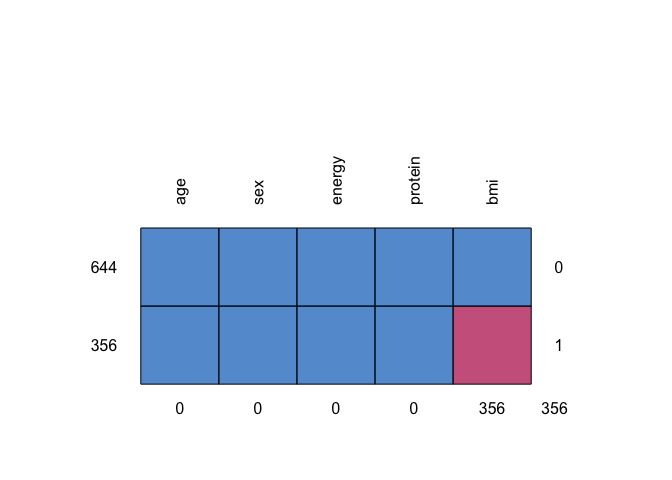
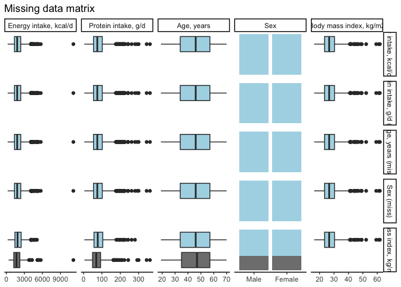

R Notebook
================
Hannah Han

# 1. Preparation

## Import pacakges

``` r
# install.packages(c("GGally", "mice", "tidyverse", "finalfit"))
library(tidyverse) # for data wraggling
```

    ## ── Attaching packages ─────────────────────────────────────── tidyverse 1.3.2 ──
    ## ✔ ggplot2 3.4.0      ✔ purrr   0.3.5 
    ## ✔ tibble  3.1.8      ✔ dplyr   1.0.10
    ## ✔ tidyr   1.2.1      ✔ stringr 1.4.1 
    ## ✔ readr   2.1.3      ✔ forcats 0.5.2 
    ## ── Conflicts ────────────────────────────────────────── tidyverse_conflicts() ──
    ## ✖ dplyr::filter() masks stats::filter()
    ## ✖ dplyr::lag()    masks stats::lag()

``` r
library(finalfit) # great package to handle missing data
library(GGally) # for visualizing missing pattern
```

    ## Registered S3 method overwritten by 'GGally':
    ##   method from   
    ##   +.gg   ggplot2

``` r
library(mice) # for multiple imputation
```

    ## 
    ## Attaching package: 'mice'
    ## 
    ## The following object is masked from 'package:stats':
    ## 
    ##     filter
    ## 
    ## The following objects are masked from 'package:base':
    ## 
    ##     cbind, rbind

## Load demo data (if needed need)

``` r
<<<<<<< HEAD
load("~/Documents/GitHub/CodingClub_workshop/data/processed/cchs2015_demonstration.rdata")

# select a subset for multiple imputation exercise
=======
load( here::here("data", "processed", "cchs2015_demonstration.rdata"))
  
# select a subset of multiple imputation practice
>>>>>>> 3de5369350aaeb5b6b2833a507ccc980e1030d78
MD <- cchs2015_demonstration %>%
  select(participantid, age, sex, bmi,
         energy, protein, cho, fat)

# view MD subset
str(MD)
```

    ## tibble [1,000 × 8] (S3: tbl_df/tbl/data.frame)
    ##  $ participantid: num [1:1000] 9261 1881 16071 18893 1420 ...
    ##   ..- attr(*, "label")= chr "Unique identifier"
    ##  $ age          : num [1:1000] 20 56 35 33 49 27 35 46 55 50 ...
    ##   ..- attr(*, "label")= chr "Age, years"
    ##  $ sex          : Factor w/ 2 levels "Male","Female": 1 1 2 2 2 2 1 1 2 2 ...
    ##   ..- attr(*, "label")= chr "Sex"
    ##  $ bmi          : num [1:1000] NA 28.1 19.8 NA 22.5 ...
    ##   ..- attr(*, "label")= chr "Body mass index, kg/m2"
    ##  $ energy       : num [1:1000] 3157 1133 1879 1382 2148 ...
    ##   ..- attr(*, "label")= chr "Energy intake, kcal/d"
    ##  $ protein      : num [1:1000] 114.7 34.6 78.2 28.9 74.3 ...
    ##   ..- attr(*, "label")= chr "Protein intake, g/d"
    ##  $ cho          : num [1:1000] 291 203 137 126 321 ...
    ##   ..- attr(*, "label")= chr "Carbohydrate intake, g/d"
    ##  $ fat          : num [1:1000] 161.8 23.7 115.7 78 66.5 ...
    ##   ..- attr(*, "label")= chr "Fat intake, g/d"

``` r
summary(MD)
```

    ##  participantid        age            sex           bmi            energy       
    ##  Min.   :   76   Min.   :19.00   Male  :498   Min.   :16.27   Min.   :  209.5  
    ##  1st Qu.: 5111   1st Qu.:34.00   Female:502   1st Qu.:23.45   1st Qu.: 1348.3  
    ##  Median :10126   Median :46.00                Median :26.66   Median : 1796.2  
    ##  Mean   :10071   Mean   :45.53                Mean   :27.55   Mean   : 1953.2  
    ##  3rd Qu.:14897   3rd Qu.:57.00                3rd Qu.:30.36   3rd Qu.: 2390.3  
    ##  Max.   :20460   Max.   :70.00                Max.   :61.83   Max.   :11155.7  
    ##                                               NA's   :356                      
    ##     protein             cho               fat         
    ##  Min.   :  3.915   Min.   :  25.01   Min.   :  1.317  
    ##  1st Qu.: 54.092   1st Qu.: 152.26   1st Qu.: 43.611  
    ##  Median : 74.793   Median : 210.71   Median : 64.878  
    ##  Mean   : 83.182   Mean   : 229.71   Mean   : 73.806  
    ##  3rd Qu.:102.048   3rd Qu.: 288.48   3rd Qu.: 91.824  
    ##  Max.   :361.825   Max.   :1249.47   Max.   :534.565  
    ## 

- missing values are represented with NA
- variables with missing: bmi

# 2. Our question

**Mock question of interest**: is energy intake associated with with fat
<<<<<<< HEAD
intake? - *Dependent*: energy intake - *Main predictor*: fat intake -
*Covariates of interest*: age, sex, bmi - *Auxiliary variables*: +
Variables that are either correlated with missing variable (r \> 0.4) or
believed to be associated with missingness. *Use your knowledge!* + To
increase power and/or help make the assumption of MAR more plausible -
protein, cho
=======
intake?

- Dependent: energy intake
- Main predictor: fat intake
- Covariates of interest: age, sex, bmi
- Auxiliary variables:
  - Variables that are either correlated with missing variable (r \>
    0.4) or believed to be associated with missingness. *Use your
    knowledge!*
  - To increase power and/or help make the assumption of MAR more
    plausible
- protein, cho
>>>>>>> 3de5369350aaeb5b6b2833a507ccc980e1030d78

# 3. Explore pattern of missingness

``` r
explanatory = c("protein", "age", "sex", "bmi")
dependent = "energy"

# look for patterns of missingness
MD %>%
 missing_pattern(dependent, explanatory)
```

<!-- -->

    ##     age sex energy protein bmi    
    ## 644   1   1      1       1   1   0
    ## 356   1   1      1       1   0   1
    ##       0   0      0       0 356 356

- there are two pattern of missingness

``` r
# explore pattern of missingness
MD %>%
  missing_pairs(dependent, explanatory, position = "fill")
```

    ## Warning: Removed 356 rows containing non-finite values (`stat_boxplot()`).
    ## Removed 356 rows containing non-finite values (`stat_boxplot()`).
    ## Removed 356 rows containing non-finite values (`stat_boxplot()`).
    ## Removed 356 rows containing non-finite values (`stat_boxplot()`).
    ## Removed 356 rows containing non-finite values (`stat_boxplot()`).

<!-- --> -
pattern of missingness + *blue*: observed values + *grey*: missing
values + the distribution of observed and missing BMI can be visually
compared

``` r
# compare not missing vs. missing 
explatory_compare = c("protein", "age", "sex", "energy")
dependent_compare = "bmi"
MD %>%
  missing_compare(dependent_compare, explatory_compare) %>%
  knitr::kable(row.names=FALSE, align = c("l", "l", "r", "r", "r"))
```

| Missing data analysis: Body mass index, kg/m2 |           |    Not missing |        Missing |     p |
|:----------------------------------------------|:----------|---------------:|---------------:|------:|
| Protein intake, g/d                           | Mean (SD) |    85.3 (41.8) |    79.4 (47.6) | 0.045 |
| Age, years                                    | Mean (SD) |    45.0 (14.4) |    46.4 (13.5) | 0.129 |
| Sex                                           | Male      |     320 (64.3) |     178 (35.7) | 0.978 |
|                                               | Female    |     324 (64.5) |     178 (35.5) |       |
| Energy intake, kcal/d                         | Mean (SD) | 2012.7 (863.2) | 1845.6 (995.9) | 0.006 |

- difference in estimated protein and energy intake
  - does not satisfy MCAR, more likely to be MAR
  - would not recommend complete case analysis

# 4. deciding how to handle the data: multiple imputation

## 4.1 imputation phase

- *Dependent*: energy intake
- *Main predictor*: fat intake
- *Covariates of interest*: age, sex, bmi
- *Auxiliary variables*: protein, cho

``` r
# impute missing values for all variables using mice package
# in our case, we would just need to include all variables in MD
# number of imputation: 10
multiple_imputation = mice(
  MD,
  seed = 123,
  m = 10,
  print = FALSE) 
```

**note**: mice has many prediction methods including Predictive Mean
Matching, Chained Equations, Random Forests, etc. We are using the
default Predictive Mean Matching

## 4.2 analysis and pooling phase

``` r
model_fit <-
  with(multiple_imputation, lm(energy ~ fat + age + sex + bmi))

base::summary(mice::pool(model_fit)) %>% 
  tibble::as_tibble() |>
   knitr::kable(
     digits=2
   )
```

| term        | estimate | std.error | statistic |     df | p.value |
|:------------|---------:|----------:|----------:|-------:|--------:|
| (Intercept) |   921.66 |     85.49 |     10.78 | 378.85 |    0.00 |
| fat         |    17.04 |      0.30 |     56.15 | 992.79 |    0.00 |
| age         |    -2.53 |      0.97 |     -2.62 | 983.81 |    0.01 |
| sexFemale   |  -164.88 |     27.89 |     -5.91 | 990.49 |    0.00 |
| bmi         |    -1.01 |      2.52 |     -0.40 | 170.54 |    0.69 |

# 5. potential things to think about

- choose your auxiliary variables carefully! make sure to include all
  variables that you **think** are associated with or predict
  missingness!
- number of imputation: Recommendation varies. Rule of thumb:
  - 5-20 imputations: low fractions of missingness
  - as many as 50 or more if needed: high fraction of missingness
  - bottom line: coefficient eventually stabilize after certain number
    of imputation. Can run different time of m to assess stability
- about transformed variables: recommend to just treat them as another
  variable and back transform if necessary
- **not covered but need to know**: there are ways to assess imputation
  quality!

# 6. Reference

- Multiple Imputation in SAS. UCLA: Statistical Consulting Group. From
  <https://stats.oarc.ucla.edu/sas/seminars/multiple-imputation-in-sas/mi_new_1/>
  (accessed April 27, 2023)
- Batra, Neale, et al. The Epidemiologist R Handbook. Chapter 20 Missing
  Data. 2021.
- Enders, C. K. (2022). Applied Missing Data Analysis. Guilford
  Publications. <https://books.google.ca/books?id=b294EAAAQBAJ>
