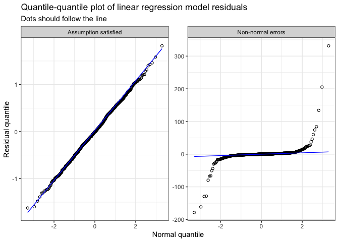
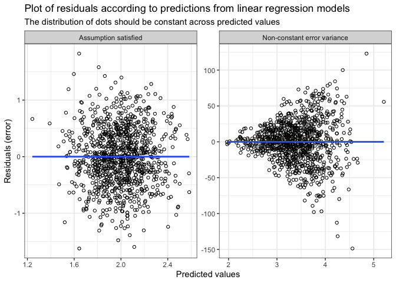
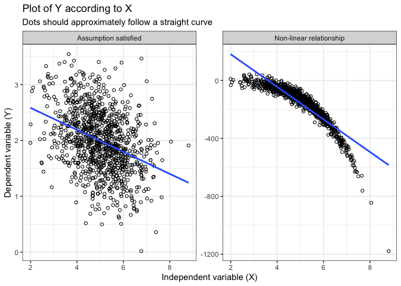

# Regression workshop: introduction
2023-04-04

- [What is ‘regression’?](#what-is-regression)
  - [Examples of regression in
    nutrition](#examples-of-regression-in-nutrition)
- [Nomenclature](#nomenclature)
  - [Notation](#notation)
  - [Language](#language)
- [Regression model equations](#regression-model-equations)
  - [Simple linear regression](#simple-linear-regression)
  - [Multiple linear regression](#multiple-linear-regression)
  - [Simple logistic regression](#simple-logistic-regression)
- [Assumptions](#assumptions)
  - [Linear regression](#linear-regression)
    - [Examples](#examples)
  - [Logistic regression](#logistic-regression)
  - [Relaxing assumptions](#relaxing-assumptions)

*Disclaimer: the goal of this workshop is to provide an introduction and
working knowledge of regression models with interest for
nutrition-related analyses. It is not intended to comprehensively cover
all aspects.*

# What is ‘regression’?

$$Y=mx+b$$

Statistical models used for descriptive research, prediction and causal
inference.

## Examples of regression in nutrition

- Prediction equation for energy expenditure
  - Harris-Benedict equation
  - Institute of Medicine equations
- Bioelectrical impedance equations
- Canadian Nutrition Screening Tool
- Estimating the effect of an intervention

Regression models sometimes have specific names depending on the
particular setting and field. For example, T-tests, ANOVA, ANCOVA are
[all regression
models!](https://drmowinckels.io/blog/2020-06-24-the-linear-regression-family-in-r/)

# Nomenclature

## Notation

- $Y$ dependent variable (i.e. outcome)
- $X$ independent variable(s)
- $Z$ sometimes used to refer to covariates
- $\beta$ regression coefficient (beta)
- $i$ individuals or observations
- $E$ expected value
  - $E(X)$ expected value of $X$
  - $E(Y|X)$ expected value of $Y$ given or conditional on $X$
  - $E(Y|X=0)$ expected value of $Y$ given or conditional on $X$ having
    a value of $0$
  - $E(Y|X, Z)$ expected value of $Y$ given or conditional on $X$
    **and** $Z$
- $\epsilon$ errors or residuals
- $i.i.d.$ independent and identically distributed
- $\sigma^2$ variance
- $N$ normality or normal distribution

## Language

- **Simple vs. multiple**: a model with only a single independent
  variable $X$ is typically termed as a simple regression model, while a
  model with two or more independent variables $X_1, X_2, ...,X_j$ is
  termed a multiple regression model.

- **Multivariable vs. multivariate**: these terms refer to two different
  types regression model. Multivari**able** is the most common model,
  where many independent variables $X_1, X_2, ...,X_j$ are considered.
  Multivar**iate** refers to a model where many dependent variables
  $Y_1, Y_2, ..., Y_k$ are considered. For examples, a multivariate
  model is necessary for a study design with repeated outcome
  measurements on the same study participants.

- **Regression coefficient, beta coefficient or** $\beta$: refer to the
  strength of the relationship between the independent and dependent
  variables. The regression coefficient typically indicates the expected
  change in outcome $Y$ for **1-unit** increase in $X$.

# Regression model equations

Regression models have a ‘generic’ format of
$Y_i=\beta_1 X_{i1}+\beta_2 X_{i2}+...\beta_j X_{ij}$. Depending on the
specific scientific objective, a choice of **distribution family** must
be made. For a given regression equation, the model’s outcome is assumed
to follow a particular theoretical distribution. Choosing the proper
distribution family is important, since it will ensure that the model
properly fits the data.

For example, to properly model a continuous outcome $Y$, we might opt
for the normal/Gaussian distribution family. Indeed, when lacking prior
information about the particular shape of the $Y$ outcome, the
normal/Gaussian is a common default choice. The corresponding regression
model is a linear regression model, typically used for continuous
outcomes. Note, however, that there are other relevant distribution
family that might better fit a given continuous outcome (e.g.,
binominal, gamma, poisson), especially when we have prior knowledge
about the shape of a given outcome’s distribution.

Another example of a common type of outcome is a binary $Y$ (yes/no or
event/no event). To model such outcome, we might opt for a binomal
distribution family with a logit link function (i.e., a transformation
of $Y$). The corresponding regression model is a logistic regression
model, typically used for binary outcomes.

## Simple linear regression

The expected value of binary $Y$ given $X$, $E(Y_i|X_i)$, is:

$$Y_i=\beta_0+\beta_XX_i+\epsilon_i$$

$$\text{with } \epsilon \sim N(\mu=0,\sigma_{\epsilon}^{2}) \text{ , i.i.d.}$$

which reads as: the expected value of continuous outcome $Y$ for
$i$th individual equals to a constant $\beta_0$ (model
intercept) plus the value of $X$ for the $i$th individual
multiplied by the regression coefficient $\beta_X$ and with errors
$\epsilon$. The model errors $\epsilon$ are assumed to follow a normal
distribution with a mean of 0 and constant variance
($\sigma_{\epsilon}^{2}$). Furthermore, errors are assumed to be
independent and identically distributed (i.i.d).

This type of model is also called an *ordinary least squares* regression
model.

## Multiple linear regression

The expected value of $Y$ given $X$, $E(Y_i|X_i,Z_i)$, is:

$$Y_i=\beta_0+\beta_XX_i+\gamma Z_i+\epsilon_i$$

$$\text{with } \epsilon \sim N(\mu=0,\sigma_{\epsilon}^{2}) \text{ , i.i.d.}$$

Note: $Z_i$ in the equation above could be a vector of covariates (i.e.,
more than one additional independent variable). $\gamma$ represents a
vector of regression coefficients. $Z$ is used instead of $X$ to
explicitely differentiate the primary variable of interest (e.g.,
intervention group) from the other covariates (e.g., age, sex).

## Simple logistic regression

The expected value of $Y$ given $X$, $E(Y_i|X_i)$, is:

$$\text{logit}(\pi)=\beta_0+\beta_XX_i$$

$$\text{with logit}(\pi)=log(\frac{\pi}{1-\pi})$$

which reads as: the expected value of the binary outcome $Y$ (denoted as
$\pi$) equals to a constant $\beta_0$ (model intercept) plus the value
of $X$ for the $i$th individual multiplied by the regression
coefficient $\beta_X$ **on the natural logarithm scale**.

Of note, statistical softwares automatically transform data as long as
the distribution family (i.e., binomial) and link (i.e., logit) are
specified and the outcome $Y$ is indeed a binary outcome.

Since the outcome is log-transformed with the “logit” link function, the
regression coefficient $\beta_X$ indicates the change in
$\text{logit}(\pi)$ on the log-scale for a 1-unit increase in $X$.
Typically, the value of the coefficient on the log scale is harder to
interpret and the coefficient is exponentiated $e^{\beta_x}$.
$e^{\beta_x}$ then equals to the **odds ratio**, which indicates the
(multiplicative) change of the odds of outcome for a 1-unit increase in
$X$. Statistical software often provides convenient options to
automatically calculate odds ratios.

# Assumptions

[“All models are wrong, but some are
useful”](https://en.wikipedia.org/wiki/All_models_are_wrong)

Even under best conditions, models never perfectly fit data and will
always be some approximation of complex phenomenon. However, care should
be taken to ensure that the statistical modelling is truthful to the
data generation process (i.e., how the data was created). One step to
ensure that the model is a good fit is to verify if the models’
assumptions are adequately satisfied.

## Linear regression

For a linear regression model (ordinary least-squares), we assume that
the errors $\epsilon$ (i.e., residuals; the difference between the
actual observed value and the value predicted by the equation) are:

1.  independent. In other words, any individuals or observations are not
    related;
2.  follow a normal/Gaussian distribution;
3.  identically distributed across values of $X$ (i.e., homoscedastic).
    In other words, the variance of the errors is the same for any $X$.

Additionally, we further assume that the relationship between $X$ and
$Y$

4.  follows a linear curve. In other words, we can draw a straight line
    across points when we draw a plot of $E(Y|X)$

[Table 1](#tbl-assumptions) presents a summary of the model assumptions,
verifications and solutions.

| Assumption       | Description                                                  | Verifications                         | Solution                                                                                  |
|:-----------------|:-------------------------------------------------------------|:--------------------------------------|:------------------------------------------------------------------------------------------|
| Independence     | Observations or individuals should be independent            | Study design                          | Use a hierarchical, mixed or random effects model instead of traditional model            |
| Normality        | Model errors/residuals follow a normal/Gaussian distribution | Quantile quantile-plot of residuals   | Transformation of dependent variable (e.g., log) or using a different distribution family |
| Homoscedasticity | Variance of errors is constant across values of X            | Plot of residuals \* predicted values | Transformation of dependent variable (e.g., log) or using a different distribution family |
| Linearity        | The relationship between X and Y is linear                   | Plot of X \* Y                        | Transformation of independent variables (e.g., restricted cubic spline)                   |

Table 1: Assumptions of linear regression model (ordinary least squares)

### Examples

Except for the independence assumption, graphical methods are helpful to
verify the normality, homoscedasticity and linearity assumptions. The
figures below demonstrate examples where the assumption is mostly
satisfied vs. mostly not satisfied.

[Figure 1](#fig-normal) shows assessment of the normality assumption.

Note that a common misconception is that the raw data, either $X$ or
$Y$, should be normally distributed. The linear regression model’s
normality assumption is **not** for a particular variable, but **for the
residual/errors** of the model. Thus, it is neither relevant nor
required to assess normality of the raw data prior to modelling.

[Figure 2](#fig-variance) show assessment of the homoscedasticity
assumption.

[Figure 3](#fig-lin) shows assessment of the linearity assumption.

## Logistic regression

For a logistic regression model, we assume that:

1.  the observations are independent. In other words, any individuals or
    observations are not related;
2.  the outcome has a linear relationship with each independent variable
    **on the log scale**.

Similar to linear regression, the independence assumption is usually
verified by knowing about the study design. The linearity assumption can
be verified by plotting logit of $Y$ according to independent
variable(s) on the log scale.

## Relaxing assumptions

It is relevant to note that there are several statistical methods to
relax the assumptions above.

For example, when dealing with multiple outcome measurements among the
same individuals, mixed models (also called hierarchical or
random-effects model) can be used to consider the correlation structure
among repeated measurements. Such models relax the **independence**
assumption.

We can relax the **normality** assumption of errors. There are other
distribution family that can be used for the distribution of residuals
(e.g., binominal, gamma, poisson). These distribution families allow to
model different types of outcome, including skewed distributions, count
data, binary outcome, etc.

When errors are not identically distributed across values of $X$ (i.e.,
heteroscedasticity), transformations of outcome variable may be
sufficient. The log transformation is common and relax the
**homoscedasticity** assumption.

Finally, simple statistical transformation (e.g., restricted cubic
spline) can be used for continuous independent variables. These
transformations allow to consider potential non-linearity and,
accordingly, relax the **linearity** assumption.
